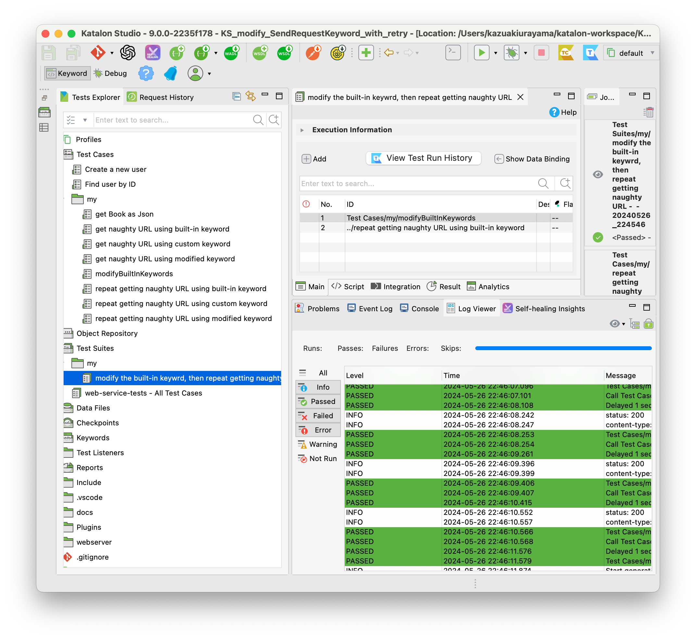

== Solution

It is ideal if the built-in `WS.sendRequest` keyword in Katalon Studio is changed to be robust against server errors. But I can't wait for their product development. Here I would show you my custom Groovy codes that give you the second best solution.

=== Where to find the source code of com.kms.katalon.core.*

In the following sections, I will present my Groovy classes. I wrote them based on the source of Katalon Studio. I found the source code of `com.kms.katalon.core.*` in the following directory of my Mac:

```
$ pwd
/Applications/Katalon Studio.app/Contents/Eclipse/configuration/resources/source

$ tree -l 1 .
1  [error opening dir]
.
├── com.kms.katalon.core
│   └── com.kms.katalon.core-sources.jar
├── com.kms.katalon.core.cucumber
│   └── com.kms.katalon.core.cucumber-sources.jar
├── com.kms.katalon.core.mobile
│   └── com.kms.katalon.core.mobile-sources.jar
├── com.kms.katalon.core.testng
│   └── com.kms.katalon.core.testng-sources.jar
├── com.kms.katalon.core.webservice
│   └── com.kms.katalon.core.webservice-sources.jar
├── com.kms.katalon.core.webui
│   └── com.kms.katalon.core.webui-sources.jar
└── com.kms.katalon.core.windows
    └── com.kms.katalon.core.windows-sources.jar
```

I unziped the jar files to get the sources in Java or Groovy. On Windows and Linux, you should be able to find the same jar files under the Katalon installed directory.

=== Custom Groovy classes

I have developed 2 Groovy classes.

==== com.kazurayam.ks.KzSendRequestKeyword

- link:https://github.com/kazurayam/KS_modify_SendRequestKeyword_with_retry/blob/develop/Keywords/com/kazurayam/ks/KzSendRequestKeyword.groovy[Keywords/com/kazurayam/ks/KzSendRequestKeyword.groovy]

This class implements an alternative to the built-in `WS.sendRequest(RequestObject, FailureHandling)` keyword. This class send an HTTP Reuest and returns the ResponseObject. The difference is that, when the server returned an HTTP respose with STATUS != 200 OK, then the class makes retry silently.

[source,groovy]
----
include::../Keywords/com/kazurayam/ks/KzSendRequestKeyword.groovy[]
----

==== com.kazurayam.ks.WSBuiltInKeywordsModifier

- link:https://github.com/kazurayam/KS_modify_SendRequestKeyword_with_retry/blob/develop/Keywords/com/kazurayam/ks/WSBuiltInKeywordsModifier.groovy[Keywords/com/kazurayam/ks/WSBuiltInKeywordsModifier.groovy]

This class modifies the `sendRequest` method of `com.kms.katalon.core.webservice.keyword.WSBuiltInKeywords` class. Once the `modifySendRequest()` methos is called, the `sendRequest` method will be dynamically changed. The `WS.sendRequest()` call will no more uses the built-in class, but the method uses the `com.kazurayam.ks.KzSendRequestKeyword`.

[source,groovy]
----
include::../Keywords/com/kazurayam/ks/WSBuiltInKeywordsModifier.groovy[]
----

=== Descriptions

==== How the custom `sendRequestWithRetry` method works

I have developed 2 Test Cases to demonstrate how I can use the custom class `com.kazurayam.ks.KzSendRequestWithRetry`.

- link:https://github.com/kazurayam/KS_modify_SendRequestKeyword_with_retry/blob/develop/Scripts/my/get%20naughty%20URL%20using%20custom%20keyword/Script1716685104583.groovy[Test Cases/my/get naught URL using custom keyword]

[source,groovy]
----
include::../Scripts/my/get naughty URL using custom keyword/Script1716685104583.groovy[]
----

- link:https://github.com/kazurayam/KS_modify_SendRequestKeyword_with_retry/blob/develop/Scripts/my/repeat%20getting%20naughty%20URL%20using%20custom%20keyword/Script1716685168111.groovy[Test Cases/my/repeat getting naughty URL using custom keyword]

[source,groovy]
----
include::../Scripts/my/repeat getting naughty URL using custom keyword/Script1716685168111.groovy[]
----

I ran the latter script which repeats calling the former script for 10 times. The former script gets the naught URL, which of course often responds with error of STATUS=500. But the the `KzSendRequestWithRetry` hide ths server error and silently makes retry. So the later script finished successful.

image:https://kazurayam.github.io/KS_modify_SendRequestKeyword_with_retry/images/03_01_repeat_using_custom_keyword.png[]

==== Want to modify the `WS.sendRequest` keyword for retry

Let me imagine that I have 200 Test Case scripts that calls the `WS.sendRequest` keyword. Now, I have developed a custom keyword `WSK.sendRequestWithRetry`. So, I should rewrite my scripts to use `WSK.sendRequestWithRetry` instead of `WS.sendRequest`. Oops, too much works. I don't like to do it. Any other idea that requires far less rewrite works?

Here I introduce the `com.kazurayam.ks.WSBuitlInKeywordsModifier`. I have made 2 Test Case scripts to demostrate how to use it.

- link:https://github.com/kazurayam/KS_modify_SendRequestKeyword_with_retry/blob/develop/Scripts/my/get%20naughty%20URL%20using%20modified%20keyword/Script1716685136061.groovy[Test Cases/my/get naughty URL using modified keyword]

In this script, I call the `WSBuildInKeywordsModifier` to dynamically replace the implementation of `sendRequest(RequestObject,FailureHandling)` of the `com.kms.katalon.core.webservice.keyword.WSBuiltInKeywords` class. The new implementation will link to the `com.kazurayam.ks.KzSendRequestKeyword` class, instead of the built-in `com.kms.katalon.core.webservice.kehyword.builtin.SendRequestKeyword`.

[source,groovy]
----
include::../Scripts/my/get naughty URL using modified keyword/Script1716685136061.groovy[]
----

The most interesting thing in this script is the following 2 lines:

[source,groovy]
----
include::../Scripts/my/get naughty URL using modified keyword/Script1716685136061.groovy[lines=15..17]
----

Here, the `sendRequest` method of `WSBuiltInKeywords` class is dynamically modified. Then we continu using the built-in `WS.sendRequest` keyword. I do not call `WSK.sendRequestWithRetry` explicitly, but I do call it indirectly.

Again, I made another scpript that calls the former script multiple times.

- link:[https://github.com/kazurayam/KS_modify_SendRequestKeyword_with_retry/blob/develop/Scripts/my/repeat%20getting%20naughty%20URL%20using%20modified%20keyword/Script1716685188007.groovy]

[source,groovy]
----
include::../Scripts/my/repeat getting naughty URL using modified keyword/Script1716685188007.groovy[]
----

When I ran the latter script, it just passed. The naughty URL reponded STATUS=500 error sometimes, but the modified `WS.sendRequest` keyword silently ignored the error and performed retry. Goodness.


==== Want to minimize the code change

The final demonstration.

I created a Test Case script

-  link:https://github.com/kazurayam/KS_modify_SendRequestKeyword_with_retry/blob/develop/Scripts/my/modifyBuiltInKeywords/Script1716684372390.groovy[Test Cases/my/modifyBuiltInKeywords]

It is simple.

[source, groovy]
----
include::../Scripts/my/modifyBuiltInKeywords/Script1716684372390.groovy[]
----

Now I created a Test Suite that combines 2 Test Cases:

1. link:https://github.com/kazurayam/KS_modify_SendRequestKeyword_with_retry/blob/develop/Scripts/my/modifyBuiltInKeywords/Script1716684372390.groovy[Test Cases/my/modifyBuiltInKeywords]
2. link:https://github.com/kazurayam/KS_modify_SendRequestKeyword_with_retry/blob/develop/Scripts/my/repeat%20getting%20naughty%20URL%20using%20built-in%20keyword/Script1716685152512.groovy[Test Cases/my/repeat getting naughty URL using built-in keyword]

With the 1st Test Case "modifyBuiltInKeywords" in the Test Suite, the built-in keyword `WS.sendRequest` is replaced with new implementation with retry.

Please note that the 2nd Test Case "get naught URL using built-in keyword" is an old one. Literally I made no change.


When I ran this Test Suite, it just passed.



The existing Test Case script performed differently as the result of the 1st script. Therefore, if you have hundreds of Test Cases that use the `WS.sendRequest` keyword, then you can add the `modifyBuiltInKeywords` script into your Test Suites. That's all. No need to change your existing Test Cases. The modified `WS.sendRequest` keyword will perform robust against the occasional server errors of STATUS=500.
