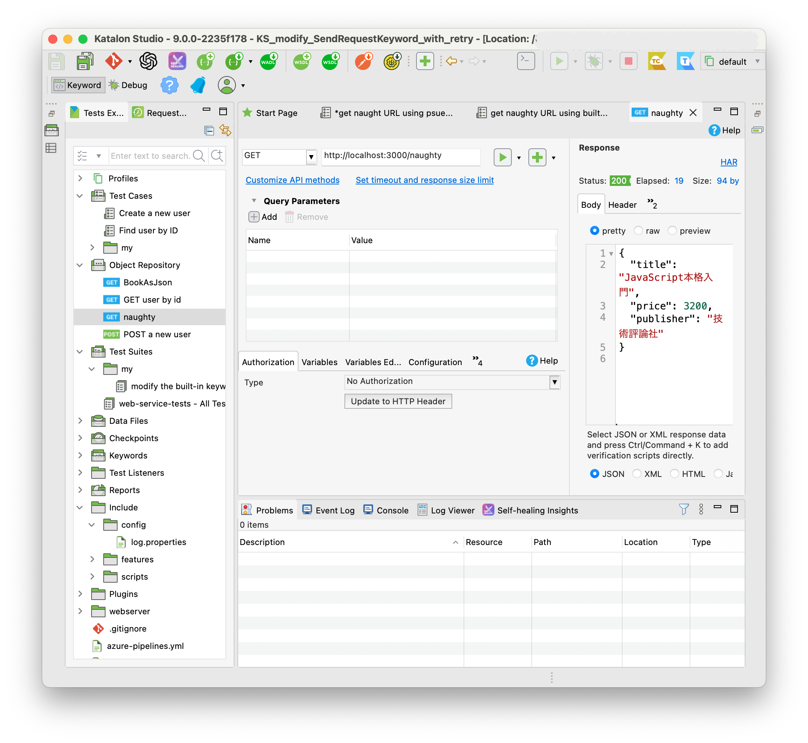
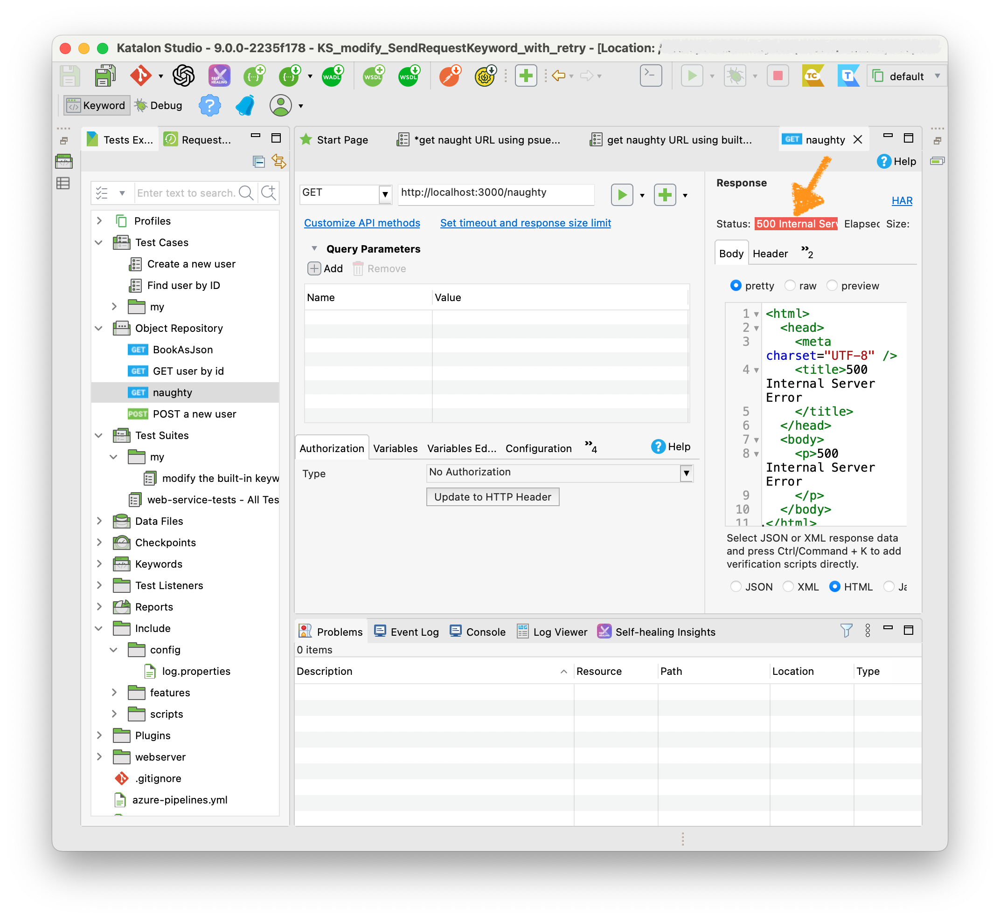

# \[Katalon Studio\] Modifying WS.sendRequest keyword to support implicit retry on server error

-   author: kazurayam

-   version: 0.3.0

-   source project: <https://gihub.com/kazurayam/KS_modify_SendRequestKeyword_with_retry>

## Problem to solve

### Application Under Test

This project bundles a HTTP Server. When the server is up, a URL becomes available:

-   <http://localhost:3000/naughty>

I will describe how to start the server up later.

This URL has following characteristics.

\(1\) It returns an HTTP response with STATUS=200 and a JSON body:

    {
      "title": "JavaScript本格入門",
      "price": 3200,
      "publisher": "技術評論社"
    }

\(2\) It occasionaly returns an HTTP response with STATUS=500 and a HTML body:

    <html>
      <head>
        <meta charset="UTF-8" />
        <title>500 Internal Server Error
        </title>
      </head>
      <body>
        
500 Internal Server Error
        

      </body>
    </html>

\(3\) It returns an Error at random. The probability is approximately 33%. 1 error per 3 requests. You can read the server source in JavaScript at <https://github.com/kazurayam/KS_modify_SendRequestKeyword_with_retry/blob/master/webserver/app.ts> ,Line#64 :

    /* an naughty URL to test the case of
     *     https://forum.katalon.com/t/how-to-retry-at-verification-tab-on-api-objet/131571/5
     *
     * In most cases, this url returns an JSON with HTTP STATUS=200.
     * But occasionaly it returns an HTML with HTTP STATUS=500.
     *
     */
    router.get("/naughty", async (_req: Request, params: Record<string, string>) => {
      const r = randomNumber({ min: 1, max: 100 });
      if (modulo(r, 3) === 0) {
        const html = await Deno.readTextFile(`error.html`);
        return new Response(html, { status: 500, headers: {"content-type": "text/html; charset=utf-8"}});
      } else {
        const html = await Deno.readTextFile(`book.json`);
        return new Response(html, { headers: {"content-type": "application/json; charset=utf-8"}});
      }
    });

## Built-in Web Server as test bed

lorem ipsum

## Solution

lorem ipsum

## Conclusion

lorem ipsum
