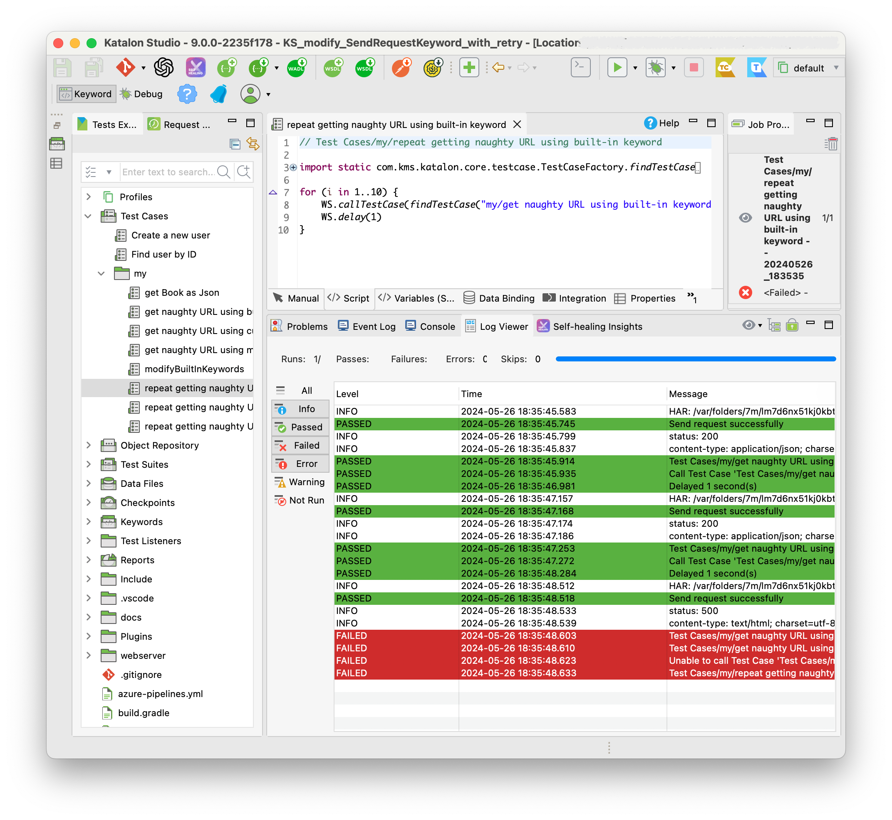

{:toc}

# \[Katalon Studio\] Modifying WS.sendRequest keyword to support implicit retry on server error

-   author: kazurayam

-   version: 0.3.0

-   source project: <https://gihub.com/kazurayam/KS_modify_SendRequestKeyword_with_retry>

## Problem to solve

### Application Under Test

This project bundles a HTTP Server that works on the localhost. Later, I will describe how to start the server on your machine. When the server is up, a URL becomes available:

-   <http://localhost:3000/naughty>

I will call this URL as **the naughty URL** for short. The naught URL has the following characteristics.

\(1\) It returns an HTTP response with STATUS=200 and a JSON body:

    {
      "title": "JavaScript本格入門",
      "price": 3200,
      "publisher": "技術評論社"
    }

\(2\) It occasionaly returns an HTTP response with STATUS=500 and a HTML body:

    <html>
      <head>
        <meta charset="UTF-8" />
        <title>500 Internal Server Error
        </title>
      </head>
      <body>
        
500 Internal Server Error
        

      </body>
    </html>

\(3\) It returns an Error at random. The probability is approximately 33%. 1 error per 3 requests. You can read the server source in TypeScript [app.ts](https://github.com/kazurayam/KS_modify_SendRequestKeyword_with_retry/blob/master/webserver/app.ts) ,Line#64 :

    router.get("/naughty", async (_req: Request, params: Record<string, string>) => {
      const r = randomNumber({ min: 1, max: 100 });
      if (modulo(r, 3) === 0) {
        const html = await Deno.readTextFile(`error.html`);
        return new Response(html, { status: 500, headers: {"content-type": "text/html; charset=utf-8"}});
      } else {
        const html = await Deno.readTextFile(`book.json`);
        return new Response(html, { headers: {"content-type": "application/json; charset=utf-8"}});
      }
    });

### Built-in WS.sendRequest keyword fails on Server Error without any retry

We have a script [Test Cases/my/get naughty URL using built-in keyword](https://github.com/kazurayam/KS_modify_SendRequestKeyword_with_retry/blob/master/Scripts/my/get%20naughty%20URL%20using%20built-in%20keyword/Script1716685092640.groovy) that makes an HTTP request to the naughty URL using the Katalon built-in keyword [WS.sendRequest](https://docs.katalon.com/katalon-studio/keywords/keyword-description-in-katalon-studio/web-service-keywords/ws-send-request).

    // Test Cases/my/get naughty URL with built-in keyword

    import static com.kms.katalon.core.testobject.ObjectRepository.findTestObject

    import com.kms.katalon.core.testobject.ResponseObject
    import com.kms.katalon.core.webservice.keyword.WSBuiltInKeywords as WS

    ResponseObject response = WS.sendRequest(findTestObject('Object Repository/naughty'))

    WS.comment("status: " + response.getStatusCode())
    WS.comment("content-type: " + response.getContentType())
    println(response.getResponseBodyContent())

    assert response.getStatusCode() == 200
    assert response.getContentType().toLowerCase().contains("json")

Please note that this script asserts that the response has the HTTP STATUS "200 OK" and the Content-Type to be "json". If the HTTP STATUS is found to be "500", then this script will fail.

We have another scipt [Test Cases/my/repeat getting naught URL using built-in keyword](https://github.com/kazurayam/KS_modify_SendRequestKeyword_with_retry/blob/develop/Scripts/my/repeat%20getting%20naughty%20URL%20using%20built-in%20keyword/Script1716685152512.groovy).

    // Test Cases/my/repeat getting naughty URL using built-in keyword

    import static com.kms.katalon.core.testcase.TestCaseFactory.findTestCase

    import com.kms.katalon.core.webservice.keyword.WSBuiltInKeywords as WS

    for (i in 1..10) {
        WS.callTestCase(findTestCase("my/get naughty URL using built-in keyword"), null)
        WS.delay(1)
    }

The latter script repeats calling the former script for multiple times (actually 10 times). When I run the latter script, it always stops midway with a failure of the former script. Why the former script fails? Because the built-in `WS.sendRequest` keyword fails when the naughty URL replied a response with HTTP STATUS=500.

### Problem: WS.sendRequest keyword is too fragile against Server error

In the real world, some Katalon users developed WebService testing projects which make repetitive calls to `WS.sendRequest` keyword. For example, one has a project that makes 200 hundreds times of call to `WS.sendRequest`.

It is often the case that the UAT (Application Under Test) is still being developed so that is not robust enough. The UAT may respond with STATUS=500 rather often.
The problem is, as soon as the UAT respond an error, the test scirpt that uses `WS.sendRequest` keyword stops.

If an error occured at the 100th request, the 101th and following requests would never be carried out. There the productivity of testers would go down due to the fragility of the built-in keyword.

I, as a WS Tester using Katalon Studio, want my test to be more robust against possible flakiness of the UAT server. I want the `WS.sendRequest` keyword to ignore temporary errors of the UAT server and retry getting the target URL silently.

## Built-in Web Server as test bed

lorem ipsum

## Solution

lorem ipsum

## Conclusion

lorem ipsum
